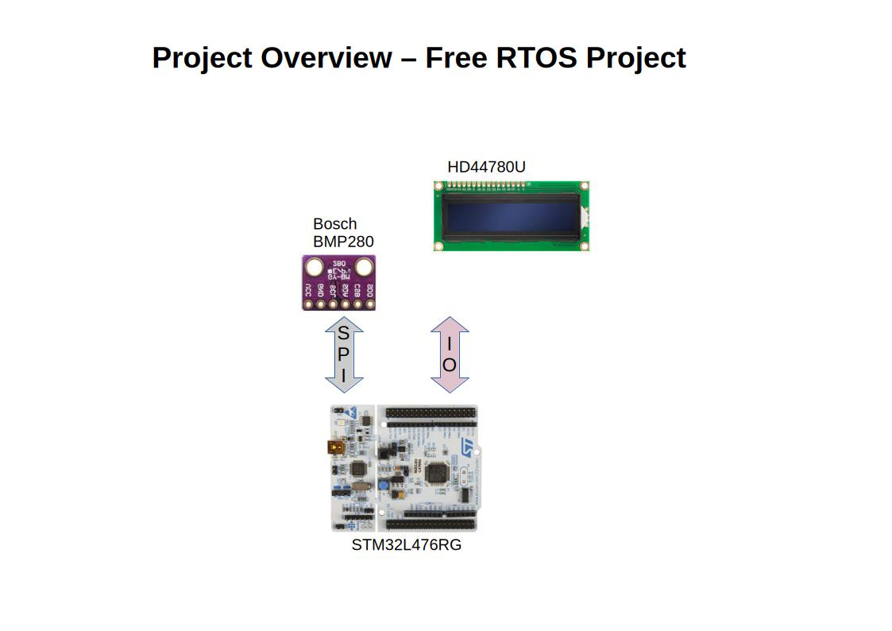
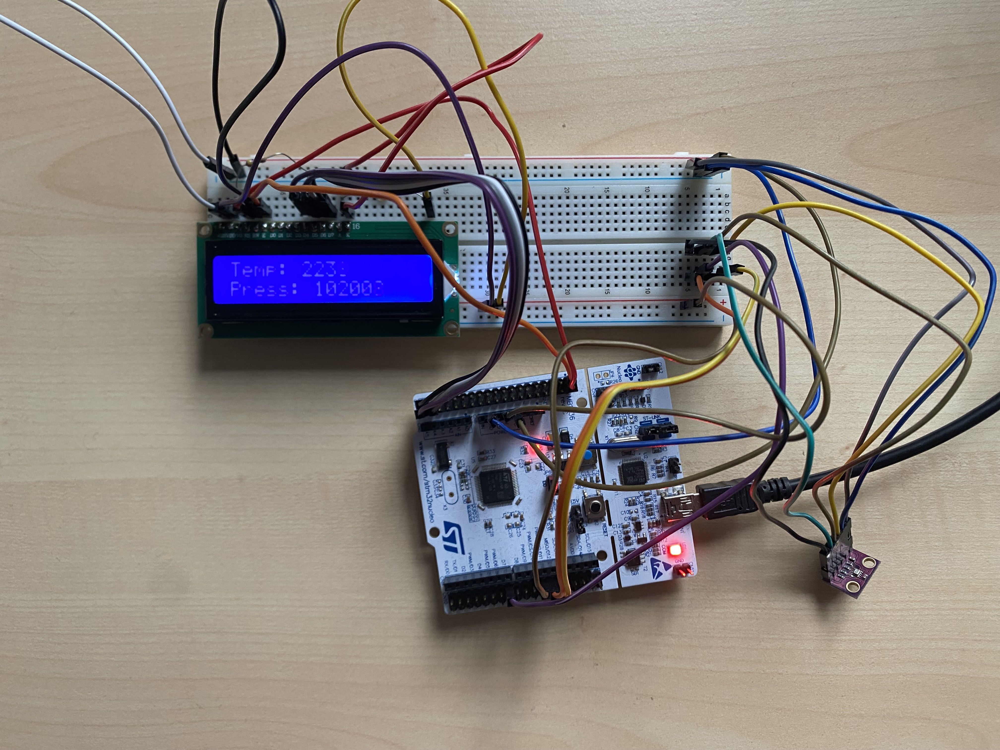

# Dual-Microcontroller CAN Bus Communication System

## Description

The goal of this project is to implement a reliable, interrupt-driven sensor acquisition system on an STM32L476RG 
microcontroller using a bare-metal, register-level programming approach in combination with FreeRTOS. The system 
reads environmental data—specifically ambient temperature and barometric pressure—from an external BMP280 digital 
sensor via SPI and displays the processed telemetry on a locally connected character LCD, driven in 4-bit mode.

Sensor communication is handled through direct register access to the SPI and DMA peripherals, avoiding the vendor 
HAL to allow fine-grained control over timing and resource usage. Data acquisition and display are separated into 
independent FreeRTOS tasks, synchronized via thread flags, message queues, and mutexes, to ensure non-blocking, 
concurrent operation.

The acquiring task retrieves raw sensor readings over SPI using DMA-based transfers, applies the manufacturer-specified
compensation algorithms to convert raw ADC values into calibrated temperature and pressure readings, and forwards the 
processed values to a display task through a message queue. The display task renders the current readings on the 
LCD—interfaced via GPIO in 4-bit mode to reduce pin usage—using a mutex to guard shared access to the display.

---

## System Architecture

For a detailed visual overview of the wiring, signal routing, and system architecture, please refer to the diagram below:

### Component Breakdown
* **Microcontrollers:**
    * **STM32L476RG** (ARM Cortex-M4, acting as primary sensor node)
* **Sensors & Peripherals:**
    * **Bosch BMP280** (Digital pressure and temperature sensor via I2C/SPI)
    * **HD44780U** (Dot-matrix LCD driver for local data visualization)

